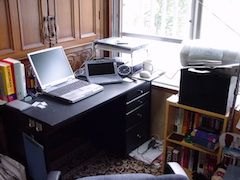
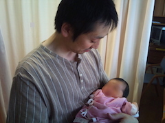

# 実践タイムリープ
## InnoCAFE#27
### 新年の抱負LT大会@福岡
2017-01-21 (金)

--

## 自己紹介
### うちこし　ゆきたか

zuzuと呼ばれたり

zuzuta22で[Twitter](http://twitter.com/zuzuta22)とか[GitHub](https://github.com/zuzuta22)やってます

--

## タイムリープとは

> 英単語「時間(time)」と「跳躍(leap)」を合せた造語であり、広く様々な形態の「時間移動」を意味する言葉として日本の創作作品などで比較的よく見かける言葉である。

出典: [ニコニコ大百科(仮)](http://dic.nicovideo.jp/a/%E3%82%BF%E3%82%A4%E3%83%A0%E3%83%AA%E3%83%BC%E3%83%97)

--
## 去年の目標
[@INNOCAFE#17 新年の抱負LT大会](https://innovator.doorkeeper.jp/events/36619)
- 幼児向けアプリリース
- 娘とのコミュニケーション強化
- 英語力強化

--

## 結果
| 目標 | 実績 |
|------|------|
|幼児向けアプリリース|未達成ってか未着手|
|娘とのコミュニケーション強化|まずまず（心の余裕のないときも…）|
|英語力強化|2日に1回くらいのシャドーウィング|

--

# 今年の抱負

--

## 「なりたかった」

## を実践する！

--

### タイムリープ先
|年齢|出来事|
|--|--|
|15歳|高校受験でいろいろ迷走|
|25歳|大学卒業後の進路検討|
|35歳|父親になる|

--

### 15歳にタイムリープ

--

ギターで食べていく！

と妄想した15の夜

--

### 38歳の15歳が演ること

- 2ヶ月に1回[Keion R40](http://xn--pckl3d1a2lubxd.com/)に参加
- 年内に4曲発信

--

### 25歳にタイムリープ

--

WEBの世界を志す

--

### 38歳の25歳がしていること

- コーダーに転職しました
- CSSとPHPをがんばる！
- 目指せ！イケてるフロントエンジニア！

--

### 35歳にタイムリープ

--

専業主婦に憧れる

--

###  38歳の35歳がやってること

一部上場企業社員からパートのおじさんへ転身

--

### モットー
- 温かい朝食と夕食を共に！
- 妻が働きやすい環境作りを努力する
- 縫い物をはじめようかな

--

## 信条
- 全力で！集中して！楽しんで！
- 時間を大切に！
- 家計のやりくり

--

## 目的

---

### 周りの人のために
- 同じ時を共にする人のために
- 妻のために
- 子供のために

---

♪ご清聴ありがとうございました♪
